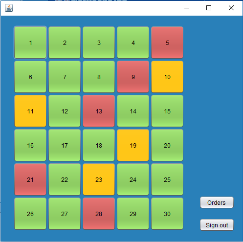
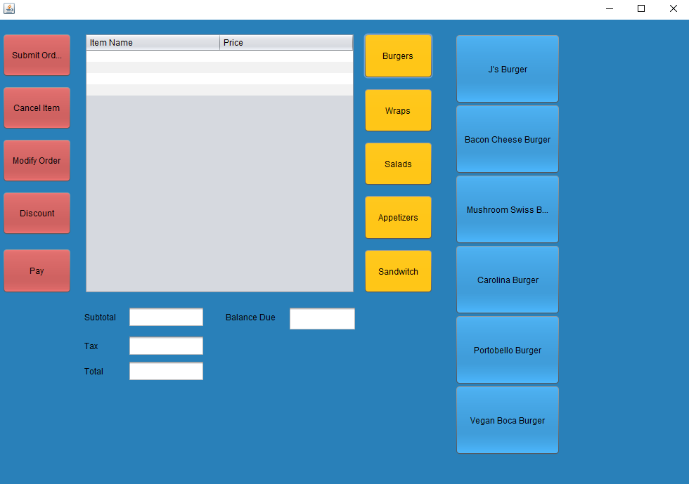
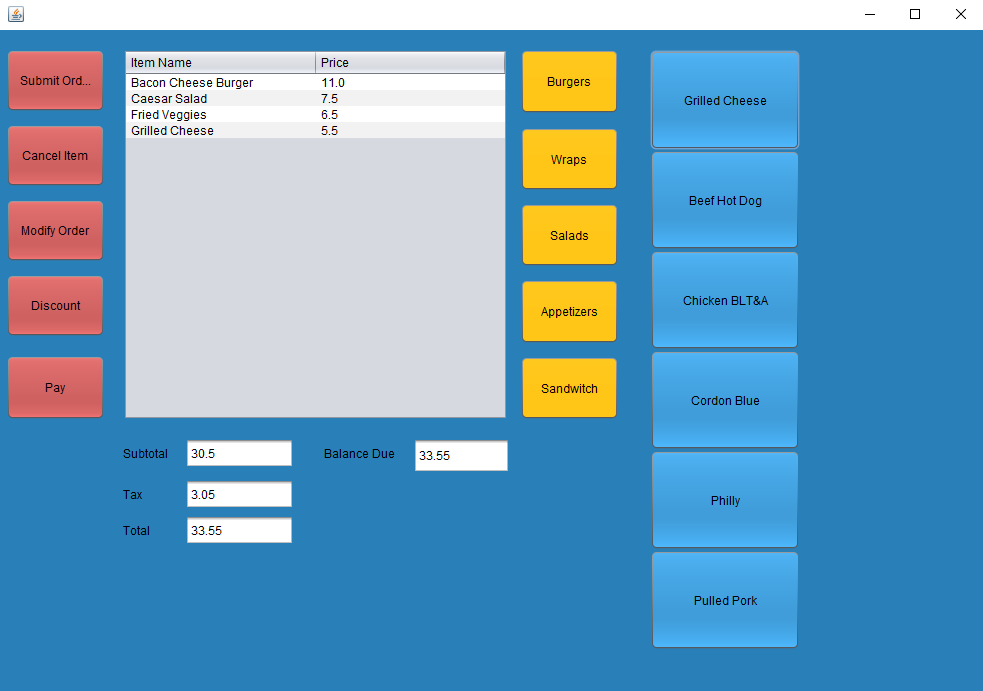

# Restaurant-Management-System

- 📄 [build.xml](build.xml)
- 📂 __dist__
  - 📄 [README.TXT](dist/README.TXT)
  - 📄 [RestaurantSystem.jar](dist/RestaurantSystem.jar)
- 📄 [list.md](list.md)
- 📄 [login.PNG](login.PNG)
- 📄 [manifest.mf](manifest.mf)
- 📂 __nbproject__
  - 📄 [build\-impl.xml](nbproject/build-impl.xml)
  - 📄 [genfiles.properties](nbproject/genfiles.properties)
  - 📂 __private__
    - 📄 [private.properties](nbproject/private/private.properties)
    - 📄 [private.xml](nbproject/private/private.xml)
  - 📄 [project.properties](nbproject/project.properties)
  - 📄 [project.xml](nbproject/project.xml)
- 📄 [r2pic.PNG](r2pic.PNG)
- 📄 [r3pic.PNG](r3pic.PNG)
- 📄 [rpic.PNG](rpic.PNG)
- 📂 __src__
  - 📂 __restaurantsystem__
    - 📄 [AddOn.java](src/restaurantsystem/AddOn.java)
    - 📄 [Driver.java](src/restaurantsystem/Driver.java)
    - 📄 [Floor.form](src/restaurantsystem/Floor.form)
    - 📄 [Floor.java](src/restaurantsystem/Floor.java)
    - 📄 [FoodItem.java](src/restaurantsystem/FoodItem.java)
    - 📄 [Login.form](src/restaurantsystem/Login.form)
    - 📄 [Login.java](src/restaurantsystem/Login.java)
    - 📄 [Order.java](src/restaurantsystem/Order.java)
    - 📄 [OrderPage.form](src/restaurantsystem/OrderPage.form)
    - 📄 [OrderPage.java](src/restaurantsystem/OrderPage.java)
    - 📄 [Pay.form](src/restaurantsystem/Pay.form)
    - 📄 [Pay.java](src/restaurantsystem/Pay.java)
    - 📄 [RestaurantSystem.java](src/restaurantsystem/RestaurantSystem.java)
    - 📄 [waiter.java](src/restaurantsystem/waiter.java)
- 📂 __test__
- 📄 [waiters.txt](waiters.txt)

